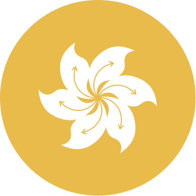

<p align="center">
  
</p>

# Bahunya

Bahunya is a small classless CSS framework. Add one stylesheet, write semantic HTML, and get a dark, responsive baseline without adding framework classes.

## Use it

```html
<link rel="stylesheet" href="https://cdn.jsdelivr.net/gh/kimeiga/bahunya/dist/bahunya.min.css">
```

Then write normal HTML:

```html
<main>
  <article>
    <h1>Hello</h1>
    <p>No framework classes required.</p>
  </article>
</main>
```

## Themes

Dark is the default. Opt into the bundled light theme on the root element:

```html
<html data-theme="light">
```

You can also override Bahunya's CSS custom properties to create your own theme.

## Navigation

Bahunya recognizes either a top-level navigation element:

```html
<nav aria-label="Primary">
  <a href="/">Home</a>
  <a href="/about">About</a>
</nav>
```

or a navigation element inside the first top-level header:

```html
<header>
  <nav aria-label="Primary">
    <a href="/">Home</a>
    <a href="/about">About</a>
  </nav>
</header>
```

The first top-level navigation item is treated as the home/brand item, so no Bahunya-specific class or ID is required. Plain nested lists support pointer hover and keyboard focus. For a submenu that must toggle reliably on touch devices, use native semantic `details`/`summary`:

```html
<nav aria-label="Primary">
  <a href="/">Home</a>
  <details>
    <summary>Products</summary>
    <ul>
      <li><a href="/one">One</a></li>
      <li><a href="/two">Two</a></li>
    </ul>
  </details>
</nav>
```

Other `nav` elements, such as pagination and article navigation, are left alone.

## Development

Bahunya has no build dependencies.

```sh
npm run build
npm test
npm run check
```

`npm run dev` rebuilds the stylesheet when files under `src/` change. Generated CSS is committed under `dist/` so the jsDelivr URL works directly from the repository.

## Goal

Bahunya provides its baseline through semantic HTML selectors rather than framework-specific classes or IDs. Its visual system uses a compact responsive type scale, touch-sized controls, restrained surfaces, and shared spacing/radius tokens while keeping markup readable.

The project intentionally does not try to express layouts that require application-specific class names.

## Credits

Bahunya was inspired by [Tacit](https://yegor256.github.io/tacit/) and [Water.css](https://watercss.kognise.dev/).

Created by [Hakan Alpay](https://hakanalpay.com). Licensed under the MIT License.
